#FinTech_Challenge_07_SQL_PassiveInvestments

This project builds an Exchange Traded Fund of four funds and visualizes the mean cumulative returns of the four funds.  The data is stored in a database and needs to be read in through SQL.  The visualizations need to be created and then a web application needs to be deployed via Voila.  

---

## Info

Author: Lisa Bailey (balllisaann@yahoo.com)

Date: 10/9/2021

Contributing Author: UW FinTech Boot Camp 2021 provided the starter files

## Technologies

Programming language: Python

Programming environment: Jupyterlab

Libraries used: 
* voila: to create a web application (note: not needed to run the Jupyter Notebook file)
* pandas: to work with dataframes
* hvplot.pandas: to create interactive plots
* sqlalchemy: to use SQL to read in and make manipulations to a database
* import warnings: to supporess an annoying deprecated function warning

---

## License

Copyright (c) 2010, Lisa Bailey (balllisaann@yahoo.com)

---

## Command Line Screenshot of Voila
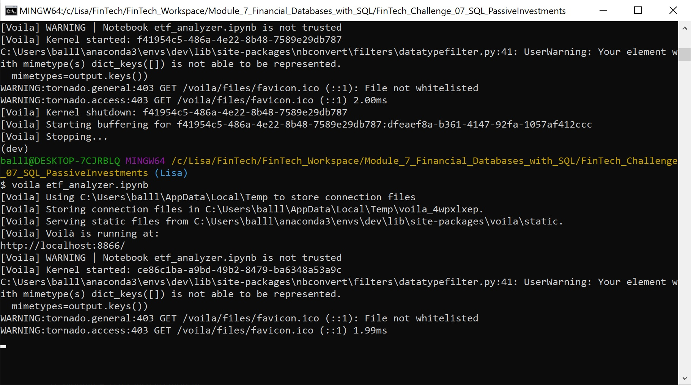

---

## Voila Web output

[Clink Link to see html](Images/etf_analyzer.html)

Or, here are the screenshots

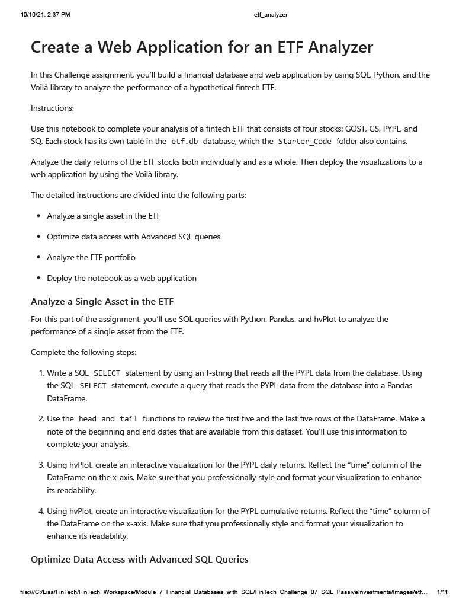
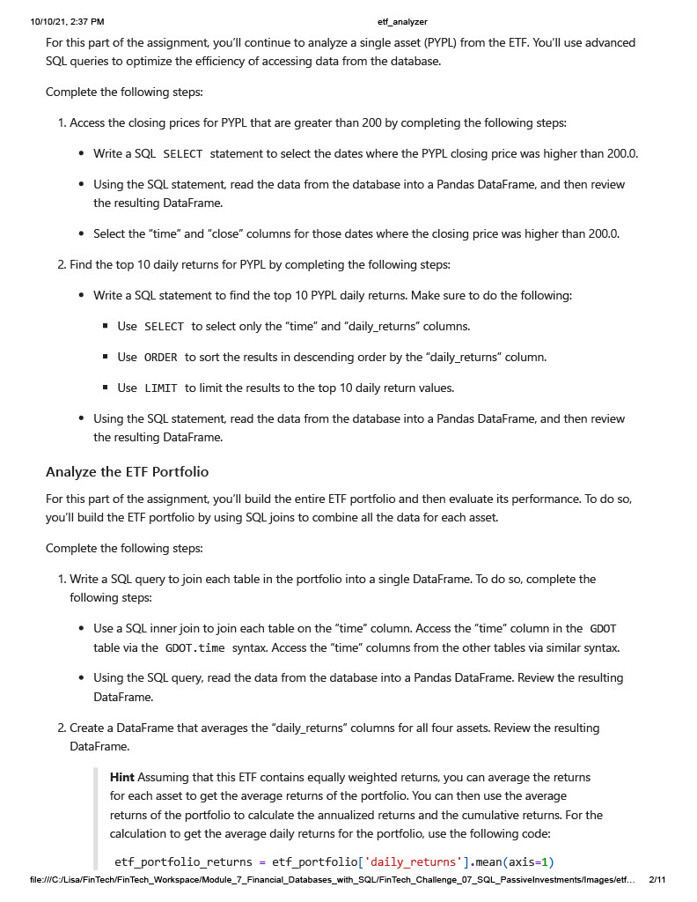
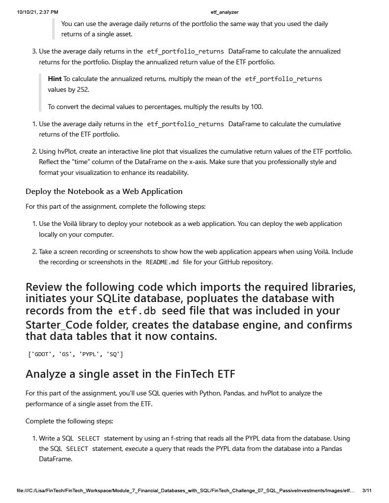
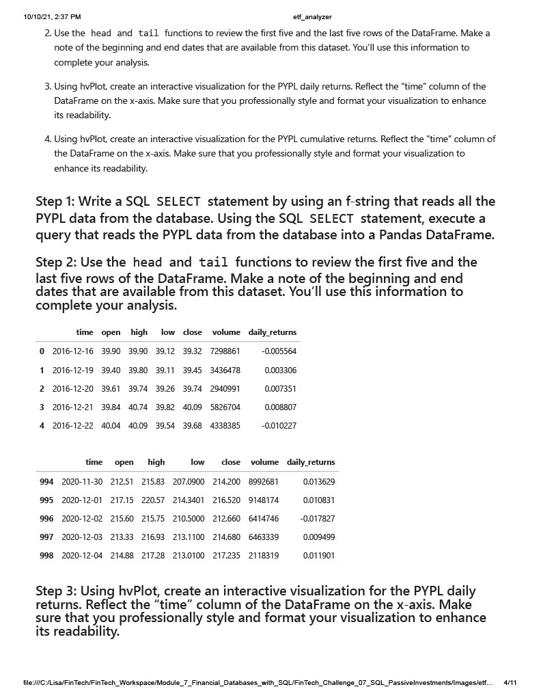
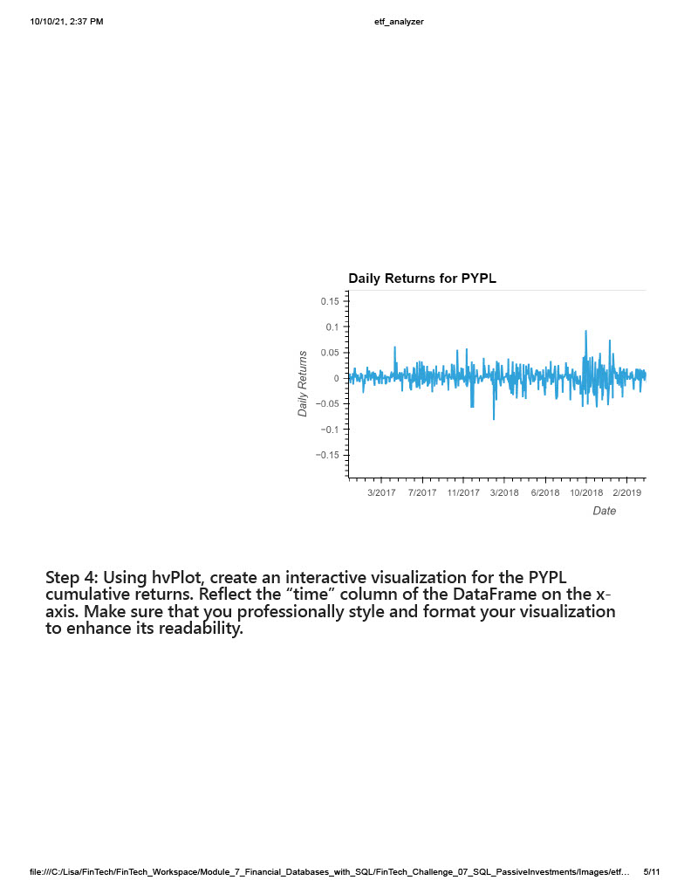
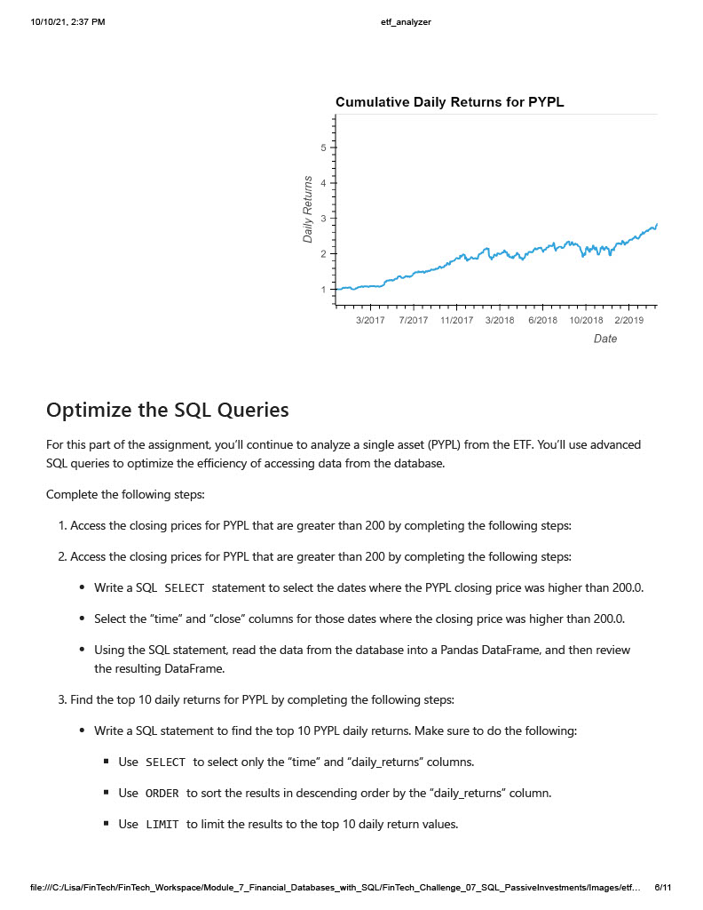
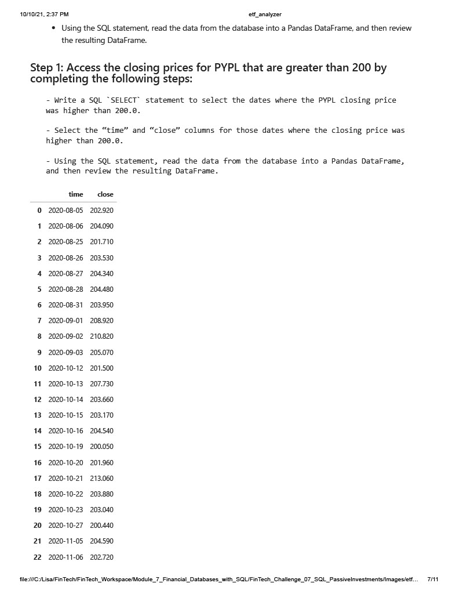
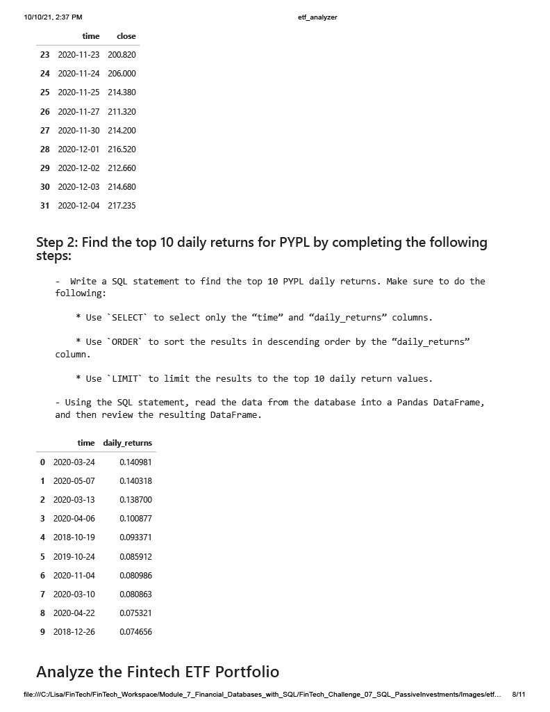
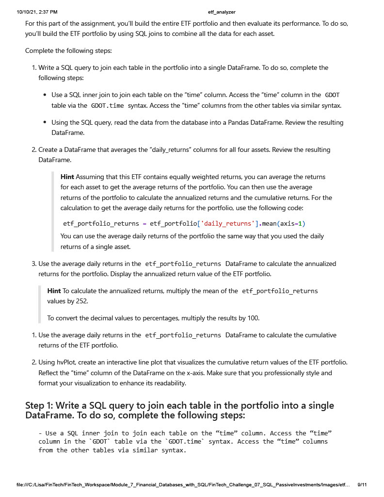
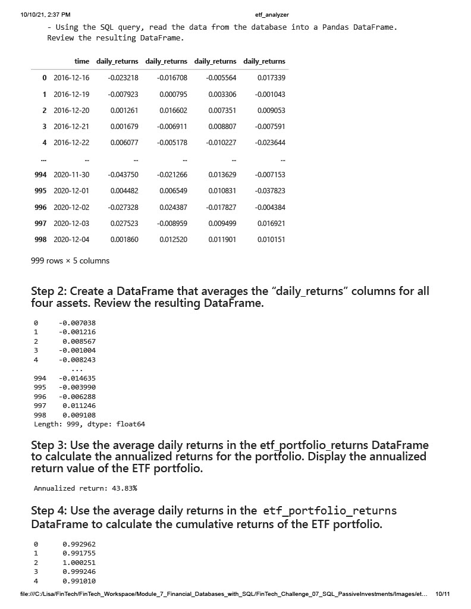
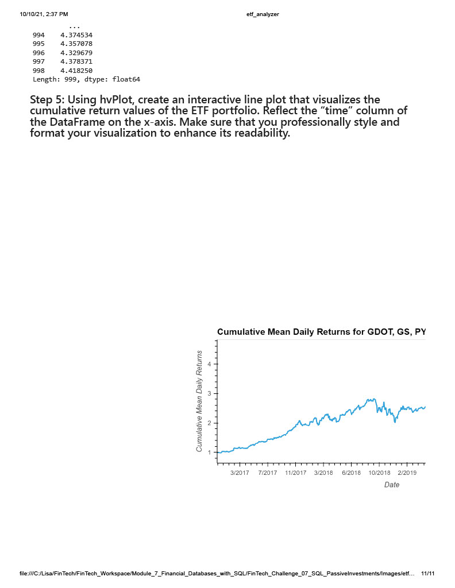

